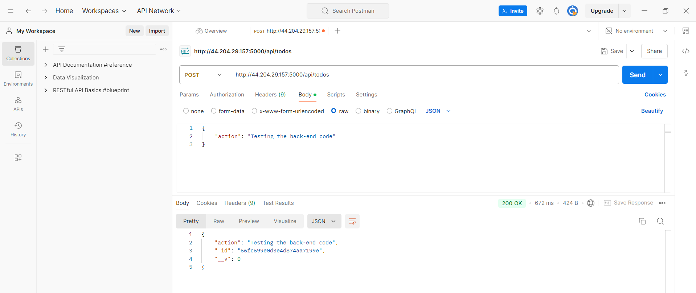
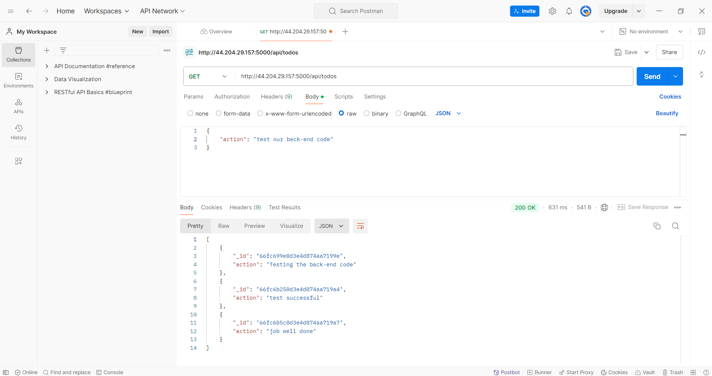
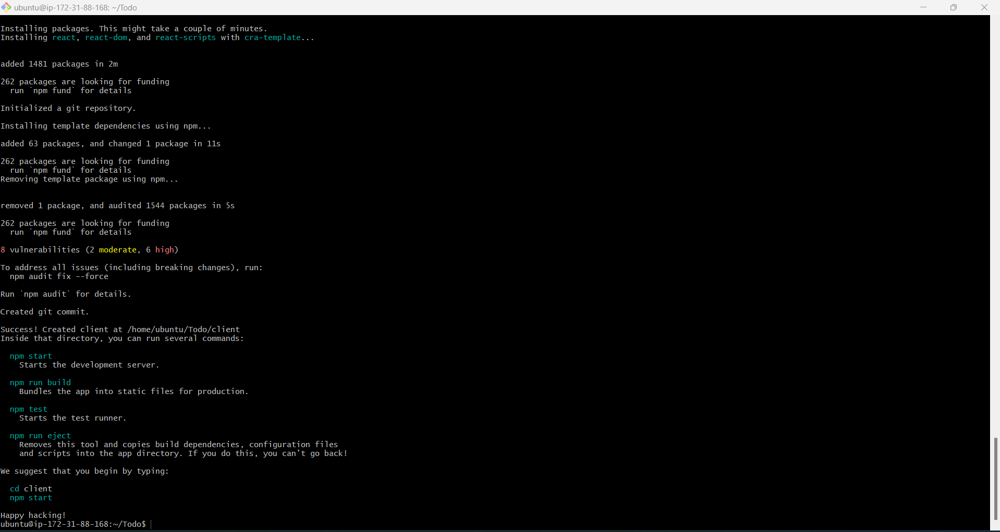
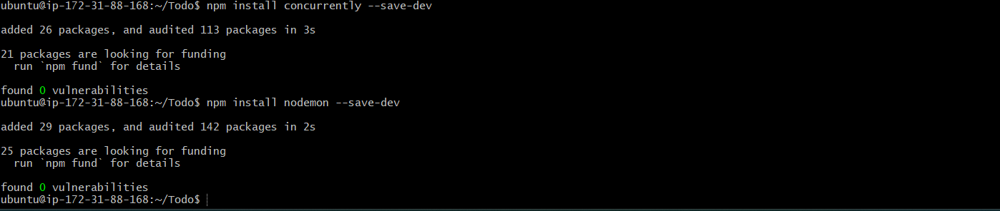
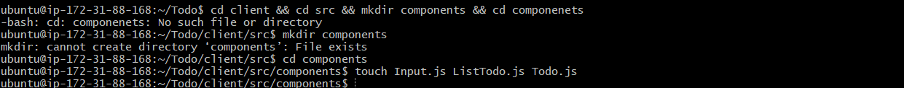
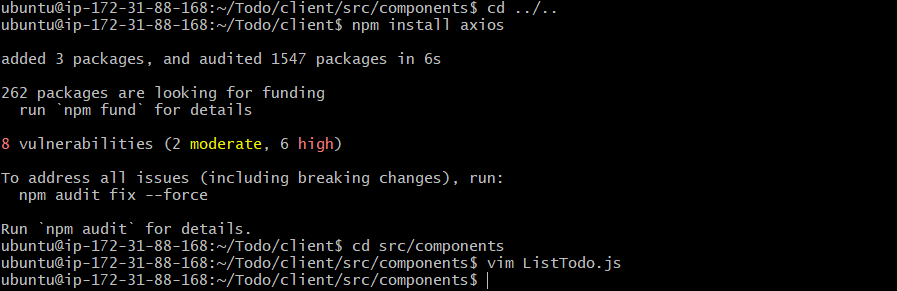
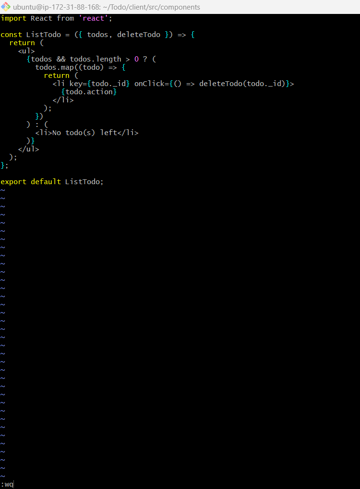
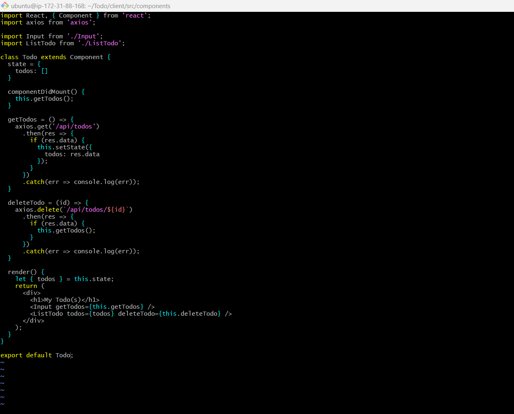
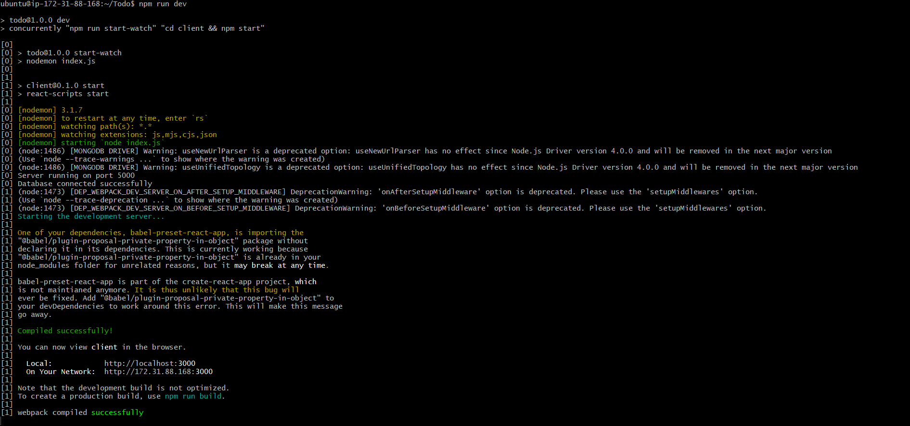

# Project Documentation: Deployment of MERN Stack on EC2 Instance

## Overview

This project is a documentation guide for setting up a MERN (MongoDb,ExpressJs,ReactJs,NodeJs) stack on an Amazon EC2 instance. The MERN stack is a popular web development environment that provides the necessary components to run dynamic websites and web applications using Javascript technologies.

### Components

- **MongoDB:** a no-sql database that store data inform of documents
- **ExpressJs:** a serverside web application javascript framework
- **ReactJs:** a frontend Javascript framework used for UI(user interface) design.
- **NodeJs:** a runtime environment that allows javascript to run on machine instead of browsers.

1. **Launch an EC2 Instance**: 
   - Sign in to the AWS Management Console.
   - Navigate to EC2 Dashboard.
   - Click on "Launch Instance" and choose Ubuntu Server 24.04 LTS as the operating system.


2. **Configure Instance Details**:
   - Choose instance type, network, subnet, and other settings as per your requirements.

3. **Add Storage**:
   - Allocate storage space according to your needs.

4. **Add Tags**:
   - Optionally, add tags for better organization.

5. **Configure Security Group**:
   - Create a new security group or use an existing one.
   - Allow inbound traffic on ports 80 (HTTP), 22 (SSH), 3000(custom), 5000(custom) and 443 (HTTPS) from your IP address


6. **Review and Launch**:
   - Review the configuration and launch the instance.


7. **Connect to the Instance**:
   - Use windows terminal/git bash to connect to the instance via SSH.
     
8. **SSH to the instance**
```bash
ssh -i key-pair.pem username@public-ip
```


## Installing MERN Stack

First, update and upgrade the Ubuntu package manager by running the command below;

```
sudo apt update && sudo apt upgrade -y
```

Then get the location of `Node.js` software from ubuntu repositories by running the command below;

```
curl fsSL https://deb.nodesource.com/setup_18.x | sudo -E bash -
```

Next thing to do is use the command below to install `Node.js` and the `npm` package manager;

```
sudo apt-get install nodejs -y
```

Verify the installation:

```
node -v   #Confirm the version of nodejs installed
npm -v    #Confirm the version of npm installed
```
  

### Setting Up the Application Directory

Create a new file directory for the Todo application project

```
mkdir Todo
```

Change the current directory to the newly created directory

```
cd Todo
```

The next step is to initialize the project directory with a `package.json` file. This file will contain some information about your app and the dependencies that it needs to run.

```
npm init
```


### Setting Up the Node Server

In this project we use `Express.js`. It is a `Node.js` HTTP framework that handles a lot of things out of the box and requires little code to create fully functional RESTful APIs. To use `Express`, install it using `npm`:

```
npm install express
```


Then, create a file `index.js` and install the `dotenv` module;

```
touch index.js
```
```
npm install dotenv
```


Open the index.js file:
```
vim index.js
```

**Copy and paste the code below into it and save it**:
```
const express = require('express');
require('dotenv').config();

const app = express();

const port = process.env.PORT || 5000;

app.use((req, res, next) => {
  res.header("Access-Control-Allow-Origin", "*");
  res.header("Access-Control-Allow-Headers", "Origin, X-Requested-With, Content-Type, Accept");
  next();
});

app.use((req, res, next) => {
  res.send('Welcome to Express');
});

app.listen(port, () => {
  console.log(`Server running on port ${port}`);
});
```
Use `:w` to save and `:qa` to exit when using 'vim' editor.


Part of the things to note in the code is that we specified to use `port: 5000`, that would be required when trying to access on the browser.

It’s time to start the server to see if it works. Run the command below in the same directory as the `index.js` file:

```
node index.js
```


if everything goes well you should see server running on port 5000


Access the server on the browser using;
> http://server-public-ip:5000


### Creating the Routes

There are three things that the `Todo` app needs to do:

- Create a task
- View all tasks
- Delete a completed task

For each task, there will be a particular endpoint and each endpoint uses different standard HTTP request methods: `POST`, `GET`, `DELETE`.
Then we need to create routes that will define multiple endpoints that the todo app will depend on. So let’s create a folder called `routes` and create a file `api.js` with the following code in it.

```
mkdir routes && cd routes && touch api.js && vim api.js
```

Copy the following code into the `api.js` file:
```
const express = require('express');
const router = express.Router();

router.get('/todos', (req, res, next) => {

});

router.post('/todos', (req, res, next) => {

});

router.delete('/todos/:id', (req, res, next) => {

});

module.exports = router;
```
   

### Defining the Models

Since the app is going to make use of `MongoDB` which is a NoSQL database, we need to create a model and a schema.

Models are defined using the schema interface. The schema allows you to define the fields stored in each document along with their validation requirements and default values.
In essence, the schema is a blueprint of how the database will be constructed.

To create a schema and a model, install Mongoose which is a Node package that makes working with MongoDB easier.

Ensure that you are in the `Todo` project directory. To navigate back to the previous directory first run:

```
cd ..
```

Then install `mongoose`:

```
npm install mongoose
```


Then, create a new folder in the `Todo` directory and name it `models`. Inside it create a file and name it `todo.js`:

```
mkdir models && cd models && touch todo.js && vim todo.js
```


Input the following code into the `todo.js` file:

```
const mongoose = require('mongoose');
const Schema = mongoose.Schema;

// Create schema for todo
const TodoSchema = new Schema({
  action: {
    type: String,
    required: [true, 'The todo text field is required']
  }
});

// Create model for todo
const Todo = mongoose.model('todo', TodoSchema);

module.exports = Todo;
```


Now, we need to update our routes to make use of the new model.  In Routes directory, open `api.js` file and delete the code inside with `:%d` and copy the code below into the file.

```
vim api.js
```
```
const express = require('express');
const router = express.Router();
const Todo = require('../models/todo');

router.get('/todos', (req, res, next) => {
  // This will return all the data, exposing only the id and action field to the client
  Todo.find({}, 'action')
    .then(data => res.json(data))
    .catch(next);
});

router.post('/todos', (req, res, next) => {
  if (req.body.action) {
    Todo.create(req.body)
      .then(data => res.json(data))
      .catch(next);
  } else {
    res.json({
      error: "The input field is empty"
    });
  }
});

router.delete('/todos/:id', (req, res, next) => {
  Todo.findOneAndDelete({"_id": req.params.id})
    .then(data => res.json(data))
    .catch(next);
});

module.exports = router;
```
   

### Creating, Configuring & Connecting to Mongo Database

Since there is a need for a database where data can be stored for the Todo application. For this, we made use of `mLab`.
`mLab` now known as `Atlas` provides MongoDB database as a service solution (DBaaS).

To make use of this service, we signed up for a shared clusters free account, and following the sign up process we select `AWS` as the cloud provider and also a prefered region close to our current location.


And we also created a Database and Collections and as well set network access to allow access to the Database from anywhere.


After successfully setting up the Mongodb enviroment, create a file in your `Todo` directory and name it `.env`, open the file:

```
touch .env && vim .env
```


Add the connection string below to access the database into the `.env` file:

```
DB = ‘mongodb+srv://<username>:<password>@<network-address>/<dbname>?retryWrites=true&w=majority’
```
Next we need to update `index.js` file to reflect the use of `.env` so that Node.js can connect to the database. 

```
vim index.js

```


Delete existing content in the file by typing `:%d` in the editor, and update it with the code below:

```
const express = require('express');
const bodyParser = require('body-parser');
const mongoose = require('mongoose');
const routes = require('./routes/api');
const path = require('path');
require('dotenv').config();

const app = express();

const port = process.env.PORT || 5000;

// Connect to the database
mongoose.connect(process.env.DB, { useNewUrlParser: true, useUnifiedTopology: true })
  .then(() => console.log(`Database connected successfully`))
  .catch(err => console.log(err));

// Since mongoose promise is deprecated, we override it with Node's promise
mongoose.Promise = global.Promise;

app.use((req, res, next) => {
  res.header("Access-Control-Allow-Origin", "*");
  res.header("Access-Control-Allow-Headers", "Origin, X-Requested-With, Content-Type, Accept");
  next();
});

app.use(bodyParser.json());

app.use('/api', routes);

app.use((err, req, res, next) => {
  console.log(err);
  next();
});

app.listen(port, () => {
  console.log(`Server running on port ${port}`);
});
```

Using environment variables to store information is considered more secure and best practice to separate configuration and secret data from the application, instead of writing connection strings directly inside the `index.js` application file.

Now start the server using the following command:

```
node index.js
```


### Testing the Backend Code using RESTful API

This is the part we start trying out things to make sure our RESTful API is working. Since the frontend is not ready yet, you can make use of some API development clients like `Postman` to test the code.

Postman was used to test the backend code. The endpoints were tested. For the endpoints that require body, JSON was sent back with the necessary fields since it’s what was set up in the code.

- Open Postman and Set the header:

> http://server-public-ip/api/todos

- Creating `POST` request to the API



**NB**: I created mutiple `POST` requests to the API, so below is the `GET` request verify each request created was successful.



- Create a `DELETE` request to the API (optional)

**Hint:** To delete a task, make sure to add it `id` as part of `DELETE` request

> DELETE server-publi-ip:5000/api/todos/5bd4edfc89d4c3228e1bbe0ad

- A final `GET` request to validate the test

  

  ## Step 2: Creating the Frontend

Since we are done with the functionality we want from the RESTful API, it is time to create an interface for the client to interact with the API. To start out with the frontend of the todo app, we will use the `create-react-app` command to scaffold the app.

In the same root directory as your backend code, which is the `ToDo` directory, run:

```
npx create-react-app client
```



### Running the React App

Before testing the React app, there are many dependencies that need to be installed in the project root directory.

First, install concurrently as a dev dependency:

```
npm install concurrently --save-dev
```

Concurrently is used to run more than one command simultaneously from the same terminal window.

Then, install nodemon as a dev dependency:

```
npm install nodemon --save-dev
```


Nodemon is used to run the server and monitor it as well. If there is any change in the server code, Nodemon will restart it automatically with the new changes.

Next, open your `package.json` file in the `Todo` directory of the app project, and change the highlighted part of the following code:

```
"scripts": {
  "start": "node index.js",
  "start-watch": "nodemon index.js",
  "dev": "concurrently \"npm run start-watch\" \"cd client && npm start\""
}
```

### Configure Proxy in `package.json` file

Navigate into the `client` directory, then locate the `package.json` file and add the following key-value pair inside it.

```
cd client
```
```
vim package.json
```
```
"proxy": "http://localhost:5000",
```


This proxy setup in our `package.json` file will enable us to make API calls without having to type the full URL,  like `http://locathost:5000` rather than always including the entire path like `http://localhost:5000/api/todosjust`

Make sure you are in the `Todo` directory and not in the `client` directory and run the command below.

```
npm run dev
```


The app opened and started running on `localhost:3000`

**NB:** In order to access the application on the browser from the internet, TCP `port 3000` had been opened on the ec2-instance security group.

### Creating the React Components

One of the advantages of React is that it makes use of components, which are reusable and also makes code modular. For the `Todo` app, there will be two state components and one stateless component.

Inside the `src` directory create another directory called `components` and inside it create three files `Input.js`, `ListTodo.js`, and `Todo.js`.

From `Todo` directory, run:

```
cd client && cd src && mkdir components && cd componenets
```
```
touch Input.js ListTodo.js Todo.js
```


Open `Input.js` file and copy the code below into the file:

```
vim Input.js
```

```
import React, { Component } from 'react';
import axios from 'axios';

class Input extends Component {
  state = {
    action: '',
  };

  addTodo = () => {
    const task = { action: this.state.action };

    if (task.action && task.action.length > 0) {
      axios
        .post('/api/todos', task)
        .then((res) => {
          if (res.data) {
            this.props.getTodos();
            this.setState({ action: '' });
          }
        })
        .catch((err) => console.log(err));
    } else {
      console.log('input field required');
    }
  };

  handleChange = (e) => {
    this.setState({
      action: e.target.value,
    });
  };

  render() {
    let { action } = this.state;
    return (
      <div>
        <input type="text" onChange={this.handleChange} value={action} />
        <button onClick={this.addTodo}>add todo</button>
      </div>
    );
  }
}

export default Input;
```

To make use of `axios`, which is a Promise-based HTTP client for the browser and Node.js, we need to navigate to the `client` directory from the terminal:

```
cd ../..
```
Then install `Axios`

```
npm install axios
```

After that is completed, we navigate back to the `components` directory

```
cd src/components
```

Then open the `ListTodo.js` file 
```
vim ListTodo.js
```


Input the code below into the file:

```
import React from 'react';

const ListTodo = ({ todos, deleteTodo }) => {
  return (
    <ul>
      {todos && todos.length > 0 ? (
        todos.map((todo) => {
          return (
            <li key={todo._id} onClick={() => deleteTodo(todo._id)}>
              {todo.action}
            </li>
          );
        })
      ) : (
        <li>No todo(s) left</li>
      )}
    </ul>
  );
};

export default ListTodo;
```


Then, open the `Todo.js` file

```
vim Todo.js
```
Input the following code below into the file:

```
import React, { Component } from 'react';
import axios from 'axios';

import Input from './Input';
import ListTodo from './ListTodo';

class Todo extends Component {
  state = {
    todos: []
  }

  componentDidMount() {
    this.getTodos();
  }

  getTodos = () => {
    axios.get('/api/todos')
      .then(res => {
        if (res.data) {
          this.setState({
            todos: res.data
          });
        }
      })
      .catch(err => console.log(err));
  }

  deleteTodo = (id) => {
    axios.delete(`/api/todos/${id}`)
      .then(res => {
        if (res.data) {
          this.getTodos();
        }
      })
      .catch(err => console.log(err));
  }

  render() {
    let { todos } = this.state;
    return (
      <div>
        <h1>My Todo(s)</h1>
        <Input getTodos={this.getTodos} />
        <ListTodo todos={todos} deleteTodo={this.deleteTodo} />
      </div>
    );
  }
}

export default Todo;
```


Now we will need to make a little adjustment to your React code. Delete the logo and adjust your `App.js`. We navigate back to the `src` directory

```
cd ..
```

Then open the `App.js` file

```
vim App.js
```
Delete the content of the file by typing `:%d` in the editor before copying the code below into the file:

```
import React from 'react';
import Todo from './components/Todo';
import './App.css';

const App = () => {
  return (
    <div className="App">
      <Todo />
    </div>
  );
};

export default App;
```
Then open the `App.css` file

```
vim App.css
```
First delete the content of the file, then copy and paste the following code into `App.css` file:

```
.App {
  text-align: center;
  font-size: calc(10px + 2vmin);
  width: 60%;
  margin-left: auto;
  margin-right: auto;
}

input {
  height: 40px;
  width: 50%;
  border: none;
  border-bottom: 2px #101113 solid;
  background: none;
  font-size: 1.5rem;
  color: #787a80;
}

input:focus {
  outline: none;
}

button {
  width: 25%;
  height: 45px;
  border: none;
  margin-left: 10px;
  font-size: 25px;
  background: #101113;
  border-radius: 5px;
  color: #787a80;
  cursor: pointer;
}

button:focus {
  outline: none;
}

ul {
  list-style: none;
  text-align: left;
  padding: 15px;
  background: #171a1f;
  border-radius: 5px;
}

li {
  padding: 15px;
  font-size: 1.5rem;
  margin-bottom: 15px;
  background: #282c34;
  border-radius: 5px;
  overflow-wrap: break-word;
  cursor: pointer;
}

@media only screen and (min-width: 300px) {
  .App {
    width: 80%;
  }

  input {
    width: 100%
  }

  button {
    width: 100%;
    margin-top: 15px;
    margin-left: 0;
  }
}

@media only screen and (min-width: 640px) {
  .App {
    width: 60%;
  }

  input {
    width: 50%;
  }

  button {
    width: 30%;
    margin-left: 10px;
    margin-top: 0;
  }
}
```

In the `src` directory, open the `index.css`

```
vim index.css
```
Copy and paste the code below into the file:

```
body {
  margin: 0;
  padding: 0;
  font-family: -apple-system, BlinkMacSystemFont, "Segoe UI", "Roboto", "Oxygen", "Ubuntu", "Cantarell", "Fira Sans", "Droid Sans", "Helvetica Neue", sans-serif;
  -webkit-font-smoothing: antialiased;
  -moz-osx-font-smoothing: grayscale;
  box-sizing: border-box;
  background-color: #282c34;
  color: #787a80;
}

code {
  font-family: source-code-pro, Menlo, Monaco, Consolas, "Courier New", monospace;
}
```

Finally we go to the `Todo` directory

```
cd ../..
```

Then run:

```
npm run dev
```


Then we try to access the server on the browser using:

> http://server-public-ip:3000


Also went ahead to interact with the `Todo` application on the browser by checking the tasks to be completed and creating new tasks.


## Conclusion

In this documentation, i created a `todo` app using the `MERN stack`. Wrote a frontend application using `React` that communicates with a backend application written using `Express.js`. I also created a `MongoDB` backend for storing tasks in a database.


---
