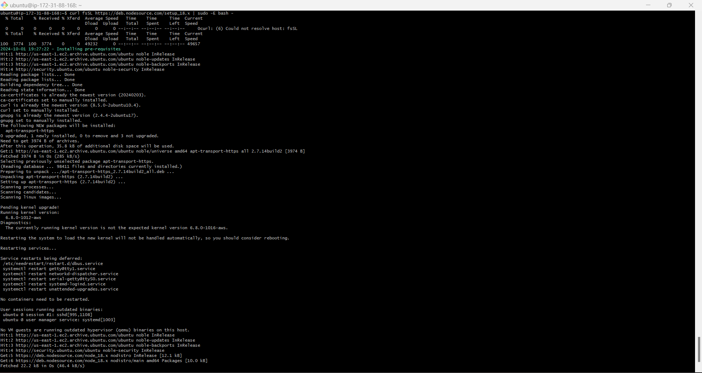

# Project Documentation: Deployment of MERN Stack on EC2 Instance

## Overview

This project is a documentation guide for setting up a MERN (MongoDb,ExpressJs,ReactJs,NodeJs) stack on an Amazon EC2 instance. The MERN stack is a popular web development environment that provides the necessary components to run dynamic websites and web applications using Javascript technologies.

### Components

- **MongoDB:** a no-sql database that store data inform of documents
- **ExpressJs:** a serverside web application javascript framework
- **ReactJs:** a frontend Javascript framework used for UI(user interface) design.
- **NodeJs:** a runtime environment that allows javascript to run on machine instead of browsers.

1. **Launch an EC2 Instance**: 
   - Sign in to the AWS Management Console.
   - Navigate to EC2 Dashboard.
   - Click on "Launch Instance" and choose Ubuntu Server 24.04 LTS as the operating system.


2. **Configure Instance Details**:
   - Choose instance type, network, subnet, and other settings as per your requirements.

3. **Add Storage**:
   - Allocate storage space according to your needs.

4. **Add Tags**:
   - Optionally, add tags for better organization.

5. **Configure Security Group**:
   - Create a new security group or use an existing one.
   - Allow inbound traffic on ports 80 (HTTP), 22 (SSH), 3000(custom), 5000(custom) and 443 (HTTPS) from your IP address


6. **Review and Launch**:
   - Review the configuration and launch the instance.


7. **Connect to the Instance**:
   - Use windows terminal/git bash to connect to the instance via SSH.
     
8. **SSH to the instance**
```bash
ssh -i key-pair.pem username@public-ip
```


## Installing MERN Stack

First, update and upgrade the Ubuntu package manager by running the command below;

```
sudo apt update && sudo apt upgrade -y
```

Then get the location of `Node.js` software from ubuntu repositories by running the command below;

```
curl fsSL https://deb.nodesource.com/setup_18.x | sudo -E bash -
```

Next thing to do is use the command below to install `Node.js` and the `npm` package manager;

```
sudo apt-get install nodejs -y
```

Verify the installation:

```
node -v   #Confirm the version of nodejs installed
npm -v    #Confirm the version of npm installed
```
  

### Setting Up the Application Directory

Create a new file directory for the Todo application project

```
mkdir Todo
```

Change the current directory to the newly created directory

```
cd Todo
```

The next step is to initialize the project directory with a `package.json` file. This file will contain some information about your app and the dependencies that it needs to run.

```
npm init
```


### Setting Up the Node Server

In this project we use `Express.js`. It is a `Node.js` HTTP framework that handles a lot of things out of the box and requires little code to create fully functional RESTful APIs. To use `Express`, install it using `npm`:

```
npm install express
```


Then, create a file `index.js` and install the `dotenv` module;

```
touch index.js
```
```
npm install dotenv
```


Open the index.js file:
```
vim index.js
```

**Copy and paste the code below into it and save it**:
```
const express = require('express');
require('dotenv').config();

const app = express();

const port = process.env.PORT || 5000;

app.use((req, res, next) => {
  res.header("Access-Control-Allow-Origin", "*");
  res.header("Access-Control-Allow-Headers", "Origin, X-Requested-With, Content-Type, Accept");
  next();
});

app.use((req, res, next) => {
  res.send('Welcome to Express');
});

app.listen(port, () => {
  console.log(`Server running on port ${port}`);
});
```
Use `:w` to save and `:qa` to exit when using 'vim' editor.


Part of the things to note in the code is that we specified to use `port: 5000`, that would be required when trying to access on the browser.

It’s time to start the server to see if it works. Run the command below in the same directory as the `index.js` file:

```
node index.js
```


if everything goes well you should see server running on port 5000


Access the server on the browser using;
> http://server-public-ip:5000


### Creating the Routes

There are three things that the `Todo` app needs to do:

- Create a task
- View all tasks
- Delete a completed task

For each task, there will be a particular endpoint and each endpoint uses different standard HTTP request methods: `POST`, `GET`, `DELETE`.
Then we need to create routes that will define multiple endpoints that the todo app will depend on. So let’s create a folder called `routes` and create a file `api.js` with the following code in it.

```
mkdir routes && cd routes && touch api.js && vim api.js
```

Copy the following code into the `api.js` file:
```
const express = require('express');
const router = express.Router();

router.get('/todos', (req, res, next) => {

});

router.post('/todos', (req, res, next) => {

});

router.delete('/todos/:id', (req, res, next) => {

});

module.exports = router;
```
   

### Defining the Models

Since the app is going to make use of `MongoDB` which is a NoSQL database, we need to create a model and a schema.

Models are defined using the schema interface. The schema allows you to define the fields stored in each document along with their validation requirements and default values.
In essence, the schema is a blueprint of how the database will be constructed.

To create a schema and a model, install Mongoose which is a Node package that makes working with MongoDB easier.

Ensure that you are in the `Todo` project directory. To navigate back to the previous directory first run:

```
cd ..
```

Then install `mongoose`:

```
npm install mongoose
```


Then, create a new folder in the `Todo` directory and name it `models`. Inside it create a file and name it `todo.js`:

```
mkdir models && cd models && touch todo.js && vim todo.js
```


Input the following code into the `todo.js` file:

```
const mongoose = require('mongoose');
const Schema = mongoose.Schema;

// Create schema for todo
const TodoSchema = new Schema({
  action: {
    type: String,
    required: [true, 'The todo text field is required']
  }
});

// Create model for todo
const Todo = mongoose.model('todo', TodoSchema);

module.exports = Todo;
```


Now, we need to update our routes to make use of the new model.  In Routes directory, open `api.js` file and delete the code inside with `:%d` and copy the code below into the file.

```
vim api.js
```
```
const express = require('express');
const router = express.Router();
const Todo = require('../models/todo');

router.get('/todos', (req, res, next) => {
  // This will return all the data, exposing only the id and action field to the client
  Todo.find({}, 'action')
    .then(data => res.json(data))
    .catch(next);
});

router.post('/todos', (req, res, next) => {
  if (req.body.action) {
    Todo.create(req.body)
      .then(data => res.json(data))
      .catch(next);
  } else {
    res.json({
      error: "The input field is empty"
    });
  }
});

router.delete('/todos/:id', (req, res, next) => {
  Todo.findOneAndDelete({"_id": req.params.id})
    .then(data => res.json(data))
    .catch(next);
});

module.exports = router;
```
   

### Creating, Configuring & Connecting to Mongo Database

Since there is a need for a database where data can be stored for the Todo application. For this, we made use of `mLab`.
`mLab` now known as `Atlas` provides MongoDB database as a service solution (DBaaS).

To make use of this service, we signed up for a shared clusters free account, and following the sign up process we select `AWS` as the cloud provider and also a prefered region close to our current location.


And we also created a Database and Collections and as well set network access to allow access to the Database from anywhere.


